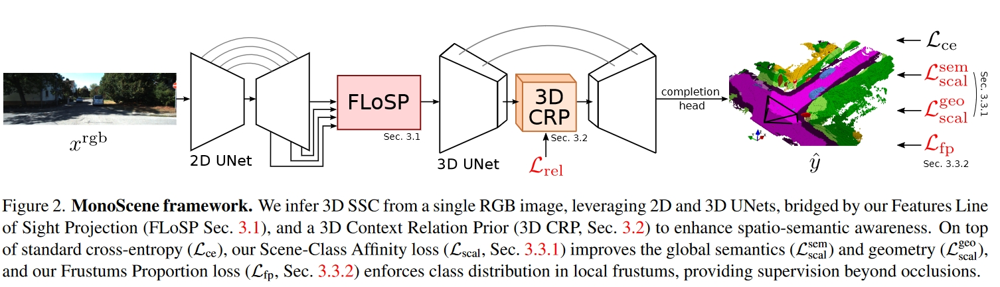
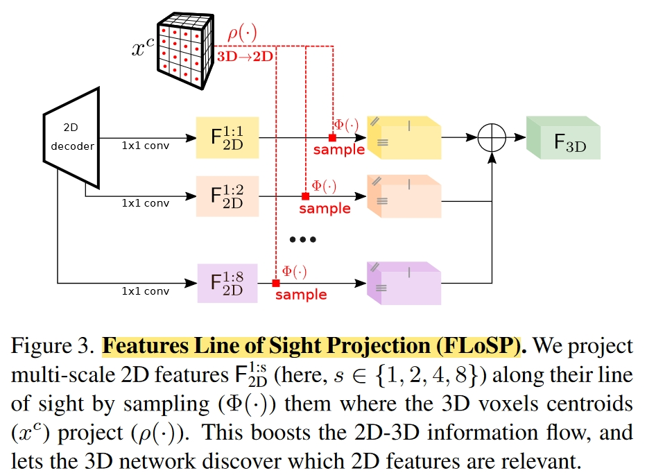
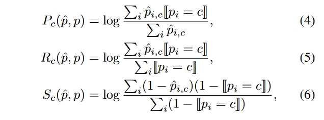
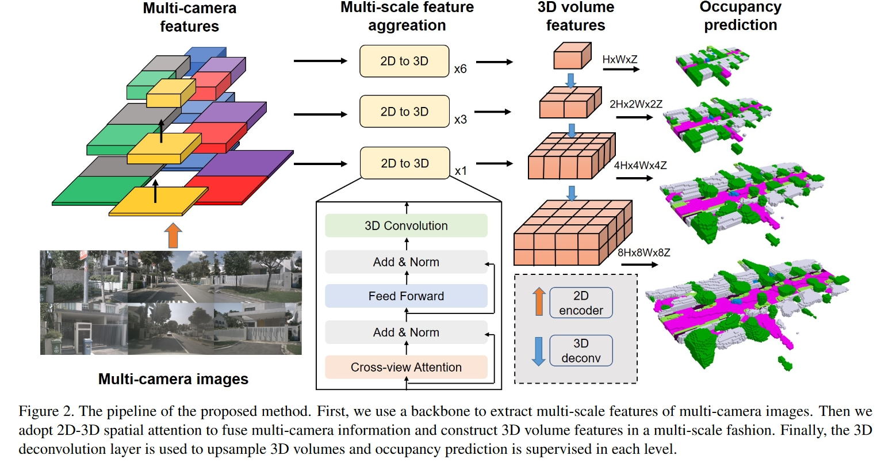

# Paper Reading -- 3D Occupancy Prediction 

---
## PLEASE USE THE FOLLOWING TEMPLATE：
## title
### Abstract
Describe what the paper have done, training srategy (supervised/unsupervised), system inputs and outputs, and application scenarios. 

### Motivation
Very important. 
Clarify the motivation behind the paper, and the comparison with prior arts.

### Framework Structure
Using screenshots if neccessary. Directly ctrlC+V. 
Provide the network details. 

### Methodology
Implementation details of contributions. Description of novel ideas. 

### Experiments
#### Metrics
#### Datasets
#### Performances

Metrics and Datasets can be ommitted if former papers have already clarified. 

---

## MonoScene: Monocular 3D Semantic Scene Completion

### Abstract
Pioneering work of 3d occ pred. 

- propose Semantic Scene Completion (SSC) task 
- supervised
- Input: single rgb
- Output: semantic + occupancy
- indoor (NYUv2) and outdoor (SemanticKITTI)

### Motivation
"Different from the SSC literature, relying on 2.5 or 3D input, we solve the complex problem of 2D to 3D scene reconstruction while jointly inferring its semantics."

"Subsequently, many algorithms use dedicated depth sensors such as Lidar [36, 50, 62] or depth cameras [2, 15, 19], easing the 3D estimation problem. These sensors are often more expensive, less compact and more intrusive than cameras which are widely spread and shipped in smartphones, drones, cars, etc. Thus, being able to estimate a 3D scene from an image would pave the way for new applications."

### Framework Structure

RGB $\Rightarrow$ **EfficientNetB7** $\Rightarrow$ 2D features  $\Rightarrow$ **FLoSP** $\Rightarrow$ 3D features $\Rightarrow$ **3D UNet (inner: 3D CRP)** $\Rightarrow$ completion head $\Rightarrow$ semantic occupancy.

### Methodology

#### Features Line of Sight Projection (FLoSP)
Lifting 2D features to 3D.

#### 3D Context Relation Prior (3D CRP)
Not important. 

#### Losses
1. Scene-Class Affinity Loss

### Experiments

#### Metrics
IoU for scene completion
mIoU for semantic scene completion

#### Datasets
1. NYUv2. Not important.
2. SemanticKITTI. SemanticKITTI [3] holds outdoor Lidar scans voxelized as 256x256x32 grid of 0.2m voxels, labeled with 21 classes (19 semantics, 1 free, 1 unknown).

#### Performances

---
## SurroundOcc: Multi-Camera 3D Occupancy Prediction for Autonomous Driving
### Abstract

- supervised learning
- input: multi-camera images
- output: dense semantic occupancy prediction
- provide a way to generate occ ground truth

### Motivation
- LiDAR
suffers from high-cost sensors and sparse scanned points.

- Multi-camera 3D object detection
suffers from the long-tail problem and difficult to recognize all classes of objects in the real world.
have difficulty describing real-world objects of **arbitrary shapes** and infinite classes.

- Depth maps
only predict the nearest occupied point in each optical ray and are unable to recover the occluded parts of the 3D scene.

- 3D occupancy representation:
naturally guarantees the multicamera geometry consistency and is able to recover occluded parts.
flexible to extend to other 3D downstream tasks

### Framework Structure

### Methodology
Implementation details of contributions. Description of novel ideas. 

### Experiments
#### Performances
SemanticKITTI test set:
- IoU: 34.72 
- MIoU: 11.86

nuScenes validation set:
- IoU: 31.49 
- MIoU: 20.30

---

## GaussianFormer: Scene as Gaussians for Vision-Based 3D Semantic Occupancy Prediction
### Abstract
- the **first object-centric representation** for 3D semantic occupancy prediction
- supervised
- comparable performance but drastically reduced memory consumption
- 

### Motivation
- Grid-based methods inevitably suffer from the redundancy of **empty grids**, resulting in more complexity for downstream tasks.
- It is also more difficult to capture **scene dynamics** with grid-based representations since it is objects instead of grids that move in the 3D space
- Dense voxel representation neglects this diversity and processes every 3D location with equal storage and computation resources, which often leads to intractable overhead because of unreasonable resource allocation.
- Although planar representations are resource-friendly, they could cause a loss of details. The grid-based methods can hardly adapt to regions of interest for different scenes and thus lead to representation and computation redundancy.

### Framework Structure

### Methodology
#### Object-centric 3D Scene Representation
- Object-centric 3D representation for 3D semantic occupancy prediction: each unit describes a region of interest instead of fixed grids. 
- Construct semantic Gaussians using: **mean, scale, rotation vectors and semantic logits**
- Generating semantics from a gaussian:
$$g(p; m, s, r, c) = \exp (−\frac{1}{2}(p − m)^T\sum^{-1}(p − m))c$$
- Generating occupancy from a gaussian:
$$\hat{o}(p;\mathcal{G}) = \sum_i g_i((p; m_i, s_i, r_i, c_i))$$
$\mathcal{G}$: a set of 3d gaussians\
$p$: coordinates of a 3d point

#### GaussianFormer: Image to Gaussians

#### Gaussian-to-Voxel Splatting

### Experiments
#### Metrics
#### Datasets
#### Performances

Metrics and Datasets can be ommitted if former papers have already clarified. 

---