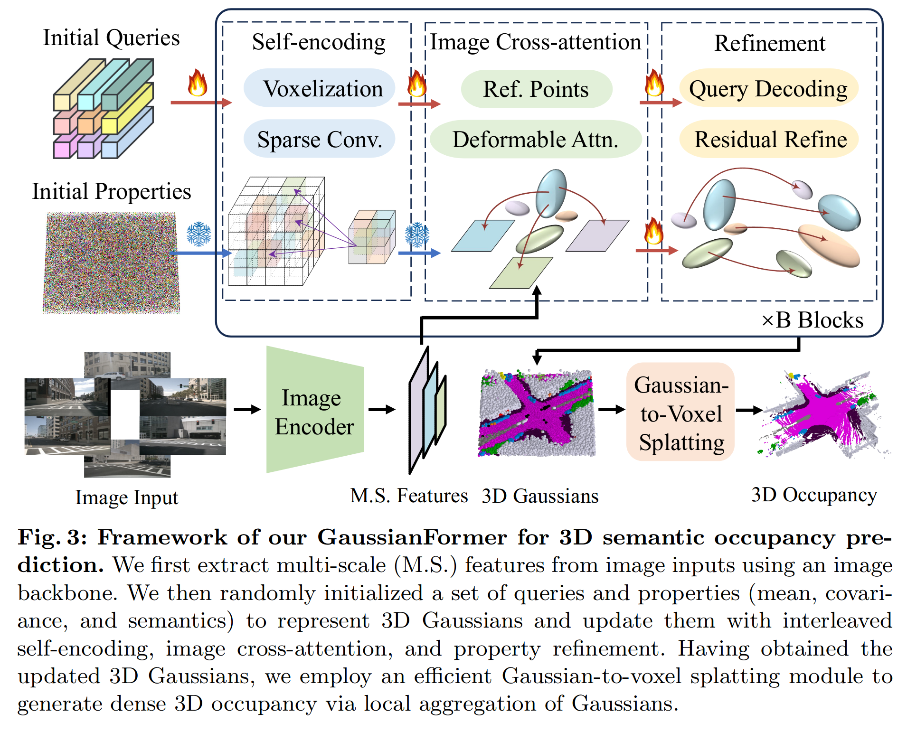

## GaussianFormer: Scene as Gaussians for Vision-Based 3D Semantic Occupancy Prediction
### Abstract
- the **first object-centric representation** for 3D semantic occupancy prediction
- supervised
- comparable performance but drastically reduced memory consumption
- 

### Motivation
- Grid-based methods inevitably suffer from the redundancy of **empty grids**, resulting in more complexity for downstream tasks.
- It is also more difficult to capture **scene dynamics** with grid-based representations since it is objects instead of grids that move in the 3D space
- Dense voxel representation neglects this diversity and processes every 3D location with equal storage and computation resources, which often leads to intractable overhead because of unreasonable resource allocation.
- Although planar representations are resource-friendly, they could cause a loss of details. The grid-based methods can hardly adapt to regions of interest for different scenes and thus lead to representation and computation redundancy.

### Framework Structure

### Methodology
#### Object-centric 3D Scene Representation
- Object-centric 3D representation for 3D semantic occupancy prediction: each unit describes a region of interest instead of fixed grids. 
- Construct semantic Gaussians using: **mean, scale, rotation vectors and semantic logits**
- Generating semantics from a gaussian:
$$g(p; m, s, r, c) = \exp (−\frac{1}{2}(p − m)^T\sum^{-1}(p − m))c$$
- Generating occupancy from a gaussian:
$$\hat{o}(p;\mathcal{G}) = \sum_i g_i((p; m_i, s_i, r_i, c_i))$$
$\mathcal{G}$: a set of 3d gaussians\
$p$: coordinates of a 3d point

#### GaussianFormer: Image to Gaussians

#### Gaussian-to-Voxel Splatting

### Experiments
#### Metrics
#### Datasets
#### Performances

Metrics and Datasets can be ommitted if former papers have already clarified. 

