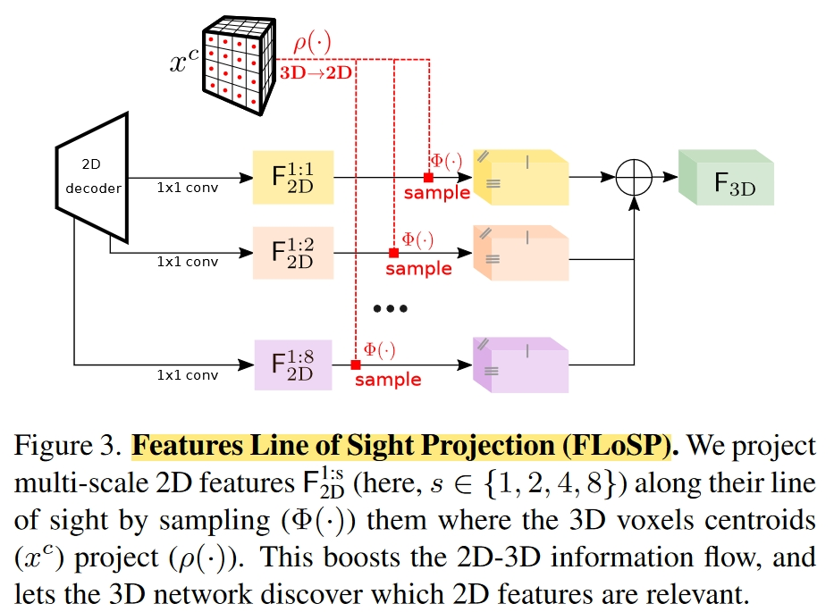
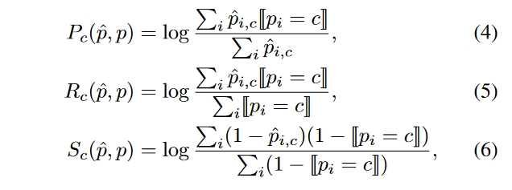

## MonoScene: Monocular 3D Semantic Scene Completion

### Abstract

Pioneering work of 3d occ pred. 

- propose Semantic Scene Completion (SSC) task 
- supervised
- Input: single rgb
- Output: semantic + occupancy
- indoor (NYUv2) and outdoor (SemanticKITTI)

### Motivation

"Different from the SSC literature, relying on 2.5 or 3D input, we solve the complex problem of 2D to 3D scene reconstruction while jointly inferring its semantics."

"Subsequently, many algorithms use dedicated depth sensors such as Lidar [36, 50, 62] or depth cameras [2, 15, 19], easing the 3D estimation problem. These sensors are often more expensive, less compact and more intrusive than cameras which are widely spread and shipped in smartphones, drones, cars, etc. Thus, being able to estimate a 3D scene from an image would pave the way for new applications."

### Framework Structure

RGB $\Rightarrow$ **EfficientNetB7** $\Rightarrow$ 2D features  $\Rightarrow$ **FLoSP** $\Rightarrow$ 3D features $\Rightarrow$ **3D UNet (inner: 3D CRP)** $\Rightarrow$ completion head $\Rightarrow$ semantic occupancy.

### Methodology

#### Features Line of Sight Projection (FLoSP)

Lifting 2D features to 3D.

#### 3D Context Relation Prior (3D CRP)

Not important. 

#### Losses

1. Scene-Class Affinity Loss

### Experiments

#### Metrics

IoU for scene completion
mIoU for semantic scene completion

#### Datasets

1. NYUv2. Not important.
2. SemanticKITTI. SemanticKITTI [3] holds outdoor Lidar scans voxelized as 256x256x32 grid of 0.2m voxels, labeled with 21 classes (19 semantics, 1 free, 1 unknown).

#### Performances

---
