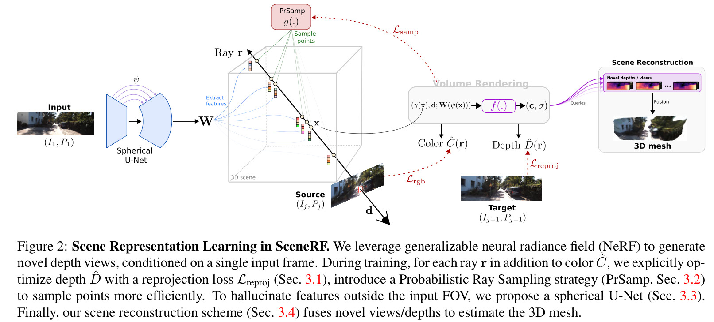
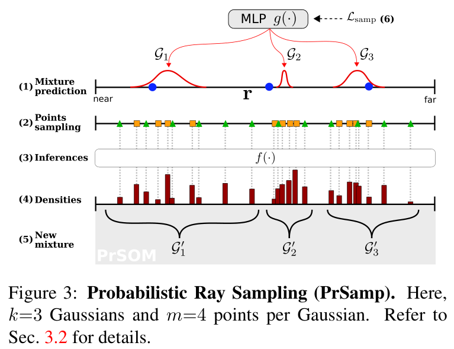
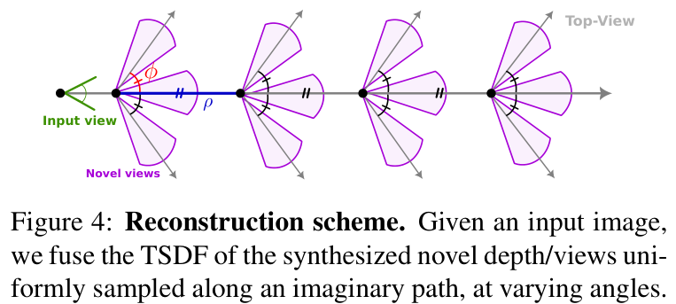

## SceneRF: Self-Supervised Monocular 3D Scene Reconstruction with Radiance Fields

ICCV23 2212.02501v4

### Abstract

Describe what the paper have done, training srategy (supervised/unsupervised), system inputs and outputs, and application scenarios. 

Self-supervised

- In: Single RGB & Pose of Novel View
- Out: RGB & Depth of Novel View

TSDF to reconstruct \[83\]

Scenarios:

- Outdoor: SemanticKITTI, generalized to nuScenes
- Indoor: BundleFusion

### Motivation

Very important. 

Clarify the motivation behind the paper, and the comparison with prior arts.

> "3D reconstruction from a single 2D image ... but relies on depth supervision at training time,"
> "a selfsupervised monocular scene reconstruction method using only posed image sequences for training. ... At inference, a single input image ... hallucinate novel depth views which are fused together to obtain 3D scene reconstruction."

- No 3d supervisions (MonoScene, Occdepth)
- No depth supervisions (\[26\], \[85\], \[8\], \[12\])
- Nerf, not object-centric (\[51\], \[65\], \[15\], \[23\], \[89\])

### Framework Structure

- Using screenshots if neccessary. Directly ctrlC+V. 
- Provide the network details. 

> "we learn a neural representation conditioned on the first frame of the sequence"
> "The conditioning learned is shared across sequences"
> "self-supervisedly optimized with all other frames"

BASELINE: PixelNeRF

- $L_{reproj}$: depth rendering + photometric loss(Monodepth2) between ($I_{j}, I_{j-1}$)
- $L_{rgb}$: photometric loss between rendering and gt
- $L_{samp}$: Contrib2

### Methodology

Implementation details of contributions. Description of novel ideas. 

- Novel probabilistic sampling strategy

> "PrSamp implicitly learns to correlate high mixture values with surface locations,"

2 steps sampling $N = k \times m + 32$

Use densities and depth to optimize mlp g(.) inferencing 1d Gaussian mixtures

$$
L_{samp} = \frac{1}{k} \sum\limits_{i=1}^{k} \mathrm{KL}(\mathscr{G}_{i}, \mathscr{G}_{i}') + \min_{i} ( \Vert \mu(\mathscr{G}'_{i}) - \hat{D}(\boldsymbol{r}) \Vert_{1})
$$

- Spheric U-Net

> "..., thus preventing estimation of color and depth (Eqs. 2,3) outside of the FOV where features cannot be extracted."
> "Because spherical projection induces less distortion than its planar counterpart"

pixel coordinates ---> camera spherical coordinates

> "SU-Net with a decoder convolving in the spherical domain. "

$$
W(\varphi(\boldsymbol{x}))
$$

- Scene reconstruction scheme

### Experiments

#### Metrics

- IoU for reconstruction
- Abs Rel ... for Novel depth estimation
- SSIM, PSNR, LPIPS for NVS (subsidiary)

#### Datasets

- Outdoor: SemanticKITTI, generalized to nuScenes
- Indoor: BundleFusion

#### Performances

Poor

Metrics and Datasets can be ommitted if former papers have already clarified. 