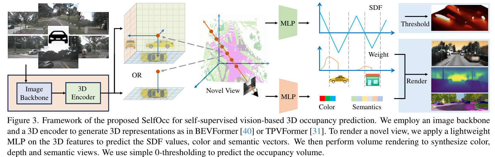
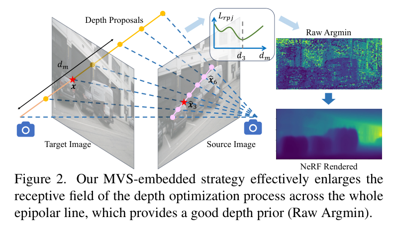

## SelfOcc: Self-Supervised Vision-Based 3D Occupancy Prediction

CVPR24 2311.12754v2

### Abstract

Describe what the paper have done, training srategy (supervised/unsupervised), system inputs and outputs, and application scenarios. 

Self-supervised

- **Surround** camera RGBs ---> "meaningful geometry"
- Prior 2D Segmentation map ---> Semantic Occupancy

Vision-centric autonomous driving

- SemanticKITTI
- KITTI-2015
- nuScenes

### Motivation

Very important. 

Clarify the motivation behind the paper, and the comparison with prior arts.

> "it is desired to learn meaningful 3D representations only from recorded video sequences without 3D labels."
> Existing unsupervised method "are still based on 2D representations in each monocular camera space. It remains challenging to obtain reasonable and comprehensive 3D representations useful for further autonomous driving prediction and planning \[29\] in a self-supervised manner." "it is nontrivial to adapt them to surround views".

### Framework Structure

- Using screenshots if neccessary. Directly ctrlC+V. 
- Provide the network details. 

$$
\boldsymbol{O} = M(\left\{ \boldsymbol{I}_{i} \right\}) = D(F(E(\boldsymbol{I}_{1}), \cdots, E(\boldsymbol{I}_{N})))
$$

### Methodology

Implementation details of contributions. Description of novel ideas. 

- Use SDF instead of densities
- MVS-embedded strategy

- SDF regularization

### Experiments

#### Metrics

#### Datasets

#### Performances

Metrics and Datasets can be ommitted if former papers have already clarified. 