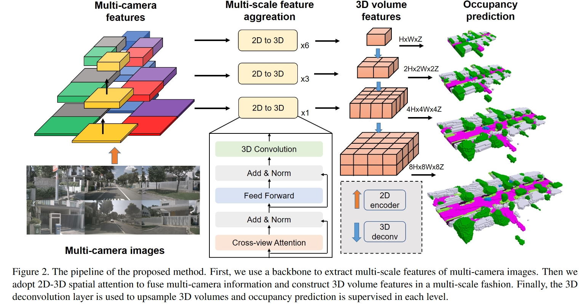

## SurroundOcc: Multi-Camera 3D Occupancy Prediction for Autonomous Driving

### Abstract

- supervised learning
- input: multi-camera images
- output: dense semantic occupancy prediction
- provide a way to generate occ ground truth

### Motivation

- LiDAR
    - suffers from high-cost sensors and sparse scanned points.
- Multi-camera 3D object detection
    - suffers from the long-tail problem and difficult to recognize all classes of objects in the real world.
    - have difficulty describing real-world objects of **arbitrary shapes** and infinite classes.
- Depth maps
    - only predict the nearest occupied point in each optical ray and are unable to recover the occluded parts of the 3D scene.
- 3D occupancy representation:
    - naturally guarantees the multicamera geometry consistency and is able to recover occluded parts.
    - flexible to extend to other 3D downstream tasks

### Framework Structure

### Methodology

Implementation details of contributions. Description of novel ideas. 

### Experiments
#### Performances
SemanticKITTI test set:
- IoU: 34.72 
- MIoU: 11.86

nuScenes validation set:
- IoU: 31.49 
- MIoU: 20.30
